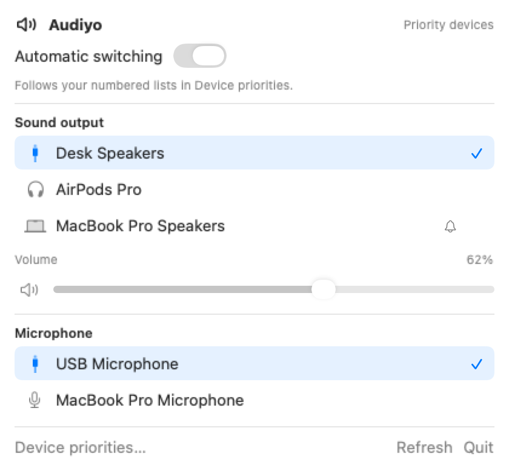
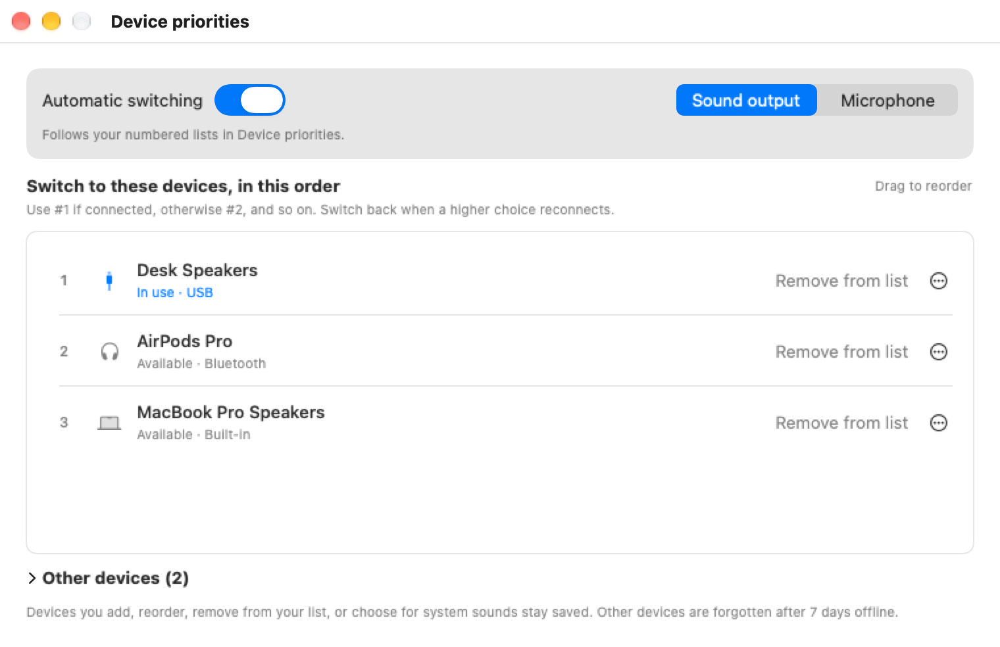

# Audiyo

A small macOS menu bar app that keeps your sound output and microphone on the devices you prefer.

<picture>
  <source media="(prefers-color-scheme: dark)" srcset="docs/menu-dark.png">
  
</picture>

macOS switches to whichever audio device connected most recently. Plug in a monitor and your sound moves to its speakers. Connect a Bluetooth headset and it takes over your microphone too. Audiyo keeps a numbered list of devices for sound output and another for your microphone. It uses the highest one that's connected and switches back when a higher choice reconnects.

## Features

- Separate priority lists for **Sound output** and **Microphone**.
- Quickly switch between connected devices in your priority lists from the menu bar, then choose **Use my list again** to go back to your order.
- Send system sounds, like alerts, to a device of your choice.
- Output volume and mute right in the menu.
- Optional notifications whenever Audiyo switches a device.
- Lives in the menu bar, the Dock, or both, and can open at login. No accounts, no network calls.

## Install

You'll need macOS 15 or later, Xcode 16 or later, and [Homebrew](https://brew.sh) to install [XcodeGen](https://github.com/yonaskolb/XcodeGen).

```sh
git clone https://github.com/DevSlashNulled/audiyo.git
cd audiyo
make bootstrap
make install
open /Applications/Audiyo.app
```

`make bootstrap` installs XcodeGen. `make install` builds a release copy and puts it in `/Applications`.

To update, quit Audiyo, pull, and run `make install` again. Your settings carry over.

There's no prebuilt download because the app isn't notarized. You build it on your own Mac.

## Getting started

<picture>
  <source media="(prefers-color-scheme: dark)" srcset="docs/priorities-dark.png">
  
</picture>

1. Click the Audiyo icon in the menu bar and choose **Device priorities…**.
2. Pick **Sound output** or **Microphone** at the top.
3. New devices wait under **Other devices**. Expand it and choose **Add to list** for each device you want Audiyo to use.
4. Drag the list into the order you want. Number 1 is your favorite.

Do the same for the other list. Audiyo starts following your order right away.

## How switching works

- Audiyo uses the first device in your list that's connected. When a higher device reconnects, it switches back.
- If nothing in your list is connected, Audiyo leaves the current device alone.
- Choosing a device from the menu bar overrides your list while that device is connected. It lasts until you choose **Use my list again** or quit Audiyo.
- The menu shows only connected devices in your priority lists, in your saved order. It stays open while you switch devices or adjust volume.
- Turn off **Automatic switching** in the menu to stop Audiyo from changing devices on its own. You can still pick devices from the menu bar.
- Devices you haven't added, removed, reordered, or picked for system sounds are forgotten after 7 days offline. Everything else stays until you choose **Forget device**. Forgotten devices show up under **Other devices** again when they reconnect.

## Good to know

- **Open Audiyo at login** only works when the app is at `/Applications/Audiyo.app`.
- Choose where system sounds play under **Settings → General → Play system sounds through**. It applies while automatic switching is on.
- Using a Bluetooth headset's microphone makes macOS drop the headset into lower quality call audio. Audiyo shows a warning in the menu when that happens. Putting a different microphone higher in your list avoids it.
- If another app keeps switching the device back, Audiyo pauses switching for a short while instead of fighting it.
- Settings are stored in `~/Library/Application Support/audiyo/config.json`.
- To report a problem, **Settings → Help → Export diagnostics…** saves a text file with your devices and recent switches.

## Uninstall

1. If you turned on **Open Audiyo at login**, turn it off in **Settings → General**.
2. Quit Audiyo from its menu bar icon and delete it from Applications.
3. To clear its settings too, run `rm -rf ~/Library/Application\ Support/audiyo` and `defaults delete local.audiyo.app`.

## Development

```sh
make test       # unit tests
make run        # debug build, opened in place
make package    # themed DMG in dist/
```

Quit the installed copy before `make run`, since both use the same settings file. Run `TEST_RUNNER_AUDIYO_CAPTURE_DIR="$PWD/docs" make test` to redraw the screenshots above from mock devices. `make package` asks Finder to lay out the DMG window, so macOS asks for Automation permission the first time. `scripts/dump-devices.sh` prints every CoreAudio device along with the last five minutes of Audiyo's logs. Run `swift scripts/generate-icon.swift` from the repo root to redraw the app icon.

## License

[MIT](LICENSE)
